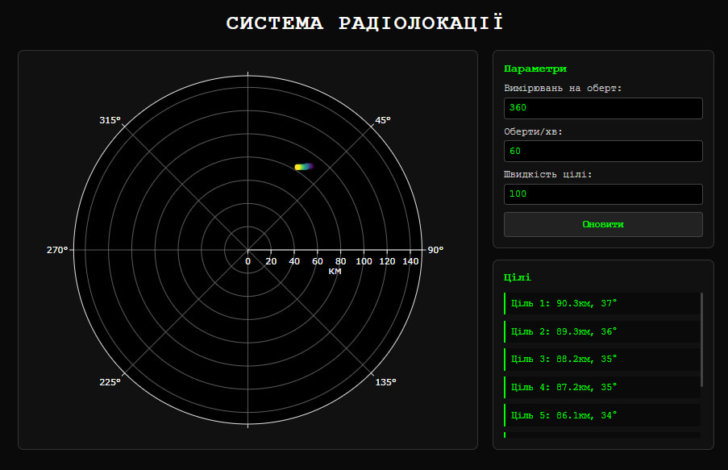
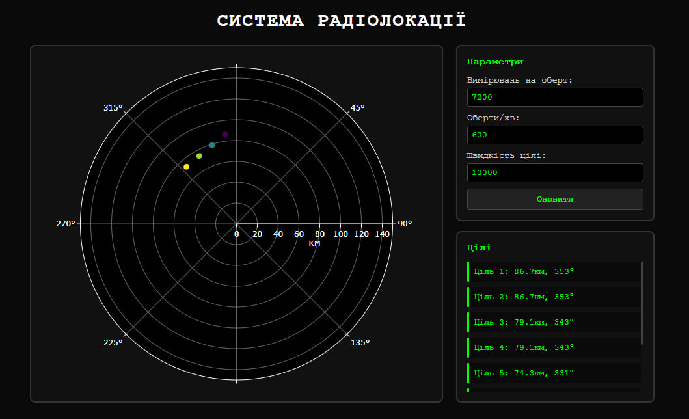

# Система радіолокації

Створено веб-додаток для візуалізації вимірювань радару в реальному часі. Система підключається до Docker-емулятора радару через WebSocket і відображає виявлені цілі на полярному графіку.

<div align="center">
  
</div>

*Скріншот показує основний інтерфейс з виявленими цілями на радарі та списком координат*

## Основний функціонал

1. **Підключення до емулятора** - автоматичне з'єднання з Docker-сервісом
2. **Візуалізація цілей** - відображення на полярному графіку в реальному часі  
3. **Розрахунок відстані** - за формулою R = (c × t) / 2
4. **Налаштування параметрів** - зміна швидкості обертання, кількості вимірювань, швидкості цілей
5. **Список цілей** - відстань та азимут кожної виявленої цілі

### Використані технології:
1. **WebSocket API** - зв'язок з емулятором
2. **Plotly.js** - полярні графіки
3. **Fetch API** - оновлення параметрів
4. **CSS Flexbox** - адаптивна верстка

## Запуск системи

### Крок 1: Запуск емулятора
```bash
docker pull iperekrestov/university:radar-emulation-service
docker run --name radar-emulator -p 4000:4000 iperekrestov/university:radar-emulation-service
```

### Крок 2: Відкриття додатку
1. Покладіть файли в одну папку
2. Відкрийте `index.html` у браузері
3. Система автоматично підключиться до `localhost:4000`

## Інтерфейс користувача

### Основні елементи:
1. **Радарний дисплей** - полярний графік з цілями
2. **Панель параметрів** - налаштування системи
3. **Список цілей** - координати виявлених об'єктів

### Параметри налаштування:
1. **Вимірювань на оберт** - кількість точок сканування (360)
2. **Оберти/хв** - швидкість обертання антени (60)
3. **Швидкість цілі** - швидкість руху об'єктів в км/год (100)

## Алгоритм роботи

### Обробка даних:
1. Отримання JSON через WebSocket з полями:
   - `scanAngle` - кут сканування в градусах
   - `echoResponses` - масив відповідей з `time` та `power`
2. Розрахунок відстані: `distance = (time × 299792.458) / 2`
3. Додавання точки на графік з координатами (кут, відстань)
4. Обмеження до 8 останніх цілей для продуктивності

### Оновлення параметрів:
1. Відправка PUT-запиту на `localhost:4000/config`
2. JSON з новими значеннями параметрів
3. Емулятор застосовує зміни миттєво

<div align="center">
  
</div>

*Приклад зміни параметрів: збільшена кількість вимірювань до 7200, швидкість обертання до 600 RPM та швидкість цілі до 10000 км/год*

## Особливості дизайну

1. **Терминальний стиль** - чорний фон, зелений текст, шрифт Courier New
2. **Мінімалістичний інтерфейс** - без зайвих елементів
3. **Адаптивність** - працює на різних розмірах екрану
4. **Автоматичне підключення** - відновлення з'єднання при розриві

# Висновки

У ході виконання даної лабораторної роботи я отримав цінний досвід розробки веб-додатків для візуалізації фізичних процесів у реальному часі. Найбільш корисним виявилося вивчення принципів роботи WebSocket з'єднань, що дозволило зрозуміти, як здійснюється обмін даними між клієнтом та сервером без постійних HTTP запитів.
Особливо важливим стало освоєння математичних основ радіолокації. Робота з формулою розрахунку відстані R = (c × t) / 2 допомогла глибше зрозуміти фізичні принципи поширення електромагнітних хвиль та їх практичне застосування у радарних системах. Це знання буде корисним для розуміння роботи сучасних систем виявлення об'єктів.
Технічно найскладнішим виявилася робота з полярними координатами та бібліотекою Plotly.js. Довелося детально вивчити особливості відображення даних у полярній системі координат, що значно розширило мої навички візуалізації даних. Також набув досвіду оптимізації продуктивності веб-додатків шляхом обмеження кількості відображуваних елементів.
Практична робота з Docker емулятором навчила мене інтегрувати веб-додатки з зовнішніми сервісами та правильно обробляти помилки мережевих з'єднань.
