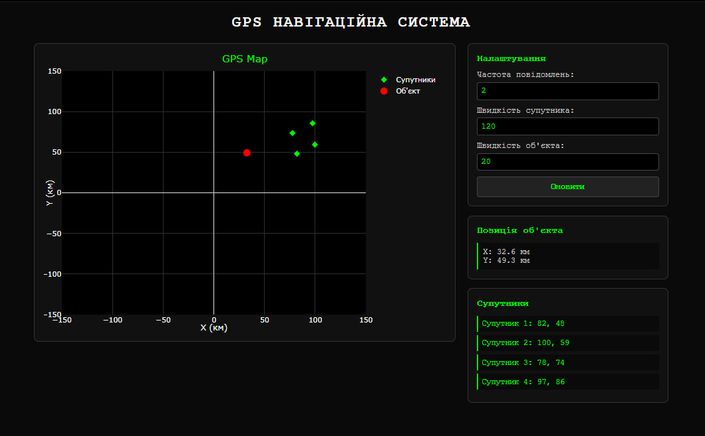
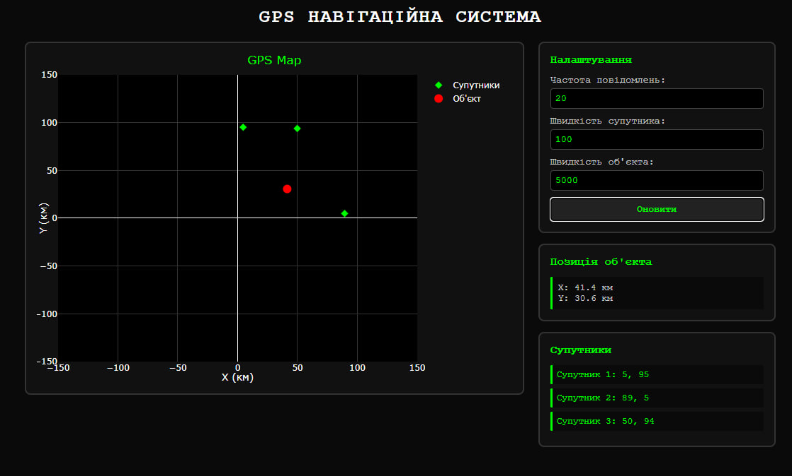

# GPS Навігаційна система

Створено веб-додаток для візуалізації GPS вимірювань в реальному часі. Система підключається до Docker-емулятора GPS через WebSocket, отримує дані від супутників та обчислює позицію об'єкта методом тріангуляції.

<div align="center">
  
</div>

*Скріншот показує карту з супутниками (зелені ромби), обчисленою позицією об'єкта (червоне коло) та інформаційними панелями*

## Основний функціонал

1. **Підключення до емулятора** - автоматичне з'єднання з Docker-сервісом на порту 4001
2. **Прийом сигналів супутників** - обробка GPS повідомлень з координатами та часовими мітками
3. **Тріангуляція** - розрахунок позиції об'єкта за 3+ супутниками
4. **Візуалізація на карті** - відображення супутників та об'єкта в декартових координатах
5. **Налаштування параметрів** - зміна частоти повідомлень, швидкості супутників та об'єкта

### Використані технології:
1. **WebSocket API** - зв'язок з емулятором GPS
2. **Plotly.js** - декартові графіки
3. **Fetch API** - оновлення параметрів
4. **JavaScript Map** - зберігання даних супутників

## Запуск системи

### Крок 1: Запуск емулятора
```bash
docker pull iperekrestov/university:gps-emulation-service
docker run --name gps-emulator -p 4001:4000 iperekrestov/university:gps-emulation-service
```

### Крок 2: Відкриття додатку
1. Покладіть файли в одну папку
2. Відкрийте `index.html` у браузері
3. Система автоматично підключиться до `localhost:4001`

## Інтерфейс користувача

### Основні елементи:
1. **GPS карта** - декартовий графік з супутниками та об'єктом
2. **Панель налаштувань** - параметри системи
3. **Позиція об'єкта** - обчислені координати X, Y
4. **Список супутників** - активні супутники з координатами

### Параметри налаштування:
1. **Частота повідомлень** - кількість сигналів на секунду (2)
2. **Швидкість супутника** - км/год руху супутників (120)
3. **Швидкість об'єкта** - км/год руху приймача (20)

## Алгоритм роботи

### Обробка GPS даних:
1. Отримання JSON через WebSocket з полями:
   - `id` - унікальний ідентифікатор супутника
   - `x, y` - координати супутника в км
   - `sentAt` - час відправки сигналу
   - `receivedAt` - час отримання сигналу
2. Розрахунок відстані: `distance = ((receivedAt - sentAt) / 1000) × 299792.458`
3. Зберігання даних супутників у Map з автоочищенням старих записів
4. Тріангуляція при наявності 3+ супутників

### Алгоритм тріангуляції:
1. Вибір 3 найближчих супутників
2. Розрахунок параметрів системи рівнянь:
   - A = 2(x₂ - x₁), B = 2(y₂ - y₁)  
   - C = r₁² - r₂² - x₁² + x₂² - y₁² + y₂²
   - D = 2(x₃ - x₂), E = 2(y₃ - y₂)
   - F = r₂² - r₃² - x₂² + x₃² - y₂² + y₃²
3. Знаходження координат: x = (C×E - F×B)/(E×A - B×D), y = (C×D - A×F)/(B×D - A×E)

### Оновлення параметрів:
1. Відправка POST-запиту на `localhost:4001/config`
2. JSON з новими значеннями параметрів
3. Емулятор застосовує зміни до GPS системи

<div align="center">
  
</div>

*Приклад зміни параметрів: збільшена частота повідомлень, змінена швидкість супутників та об'єкта для різних режимів роботи*

## Особливості дизайну

1. **Терминальний стиль** - чорний фон, зелений текст, шрифт Courier New  
2. **Декартова система координат** - X, Y осі для GPS навігації
3. **Автоматичне оновлення** - реальний час без перезавантаження
4. **Кольорове кодування** - зелені супутники, червоний об'єкт
5. **Адаптивність** - працює на різних пристроях

# Висновки

Під час виконання цієї роботи я освоїв принципи GPS навігації та алгоритм тріангуляції. Найскладнішою частиною виявилася реалізація математичної системи рівнянь для визначення позиції об'єкта за трьома супутниками.
Корисним стало розуміння роботи з часовими мітками GPS сигналів. Робота з різницею часу відправки та отримання допомогла зрозуміти важливість точності вимірювань у навігаційних системах та роль швидкості світла у розрахунках відстаней.
Технічно освоїв роботу з JavaScript Map для ефективного управління даними супутників та реалізував автоматичне очищення застарілої інформації. Також навчився працювати з декартовими координатами та їх візуалізацією у веб-інтерфейсі.
Практичне значення роботи полягає у розумінні принципів геолокації та можливості створювати веб-додатки для відображення навігаційних даних у реальному часі.